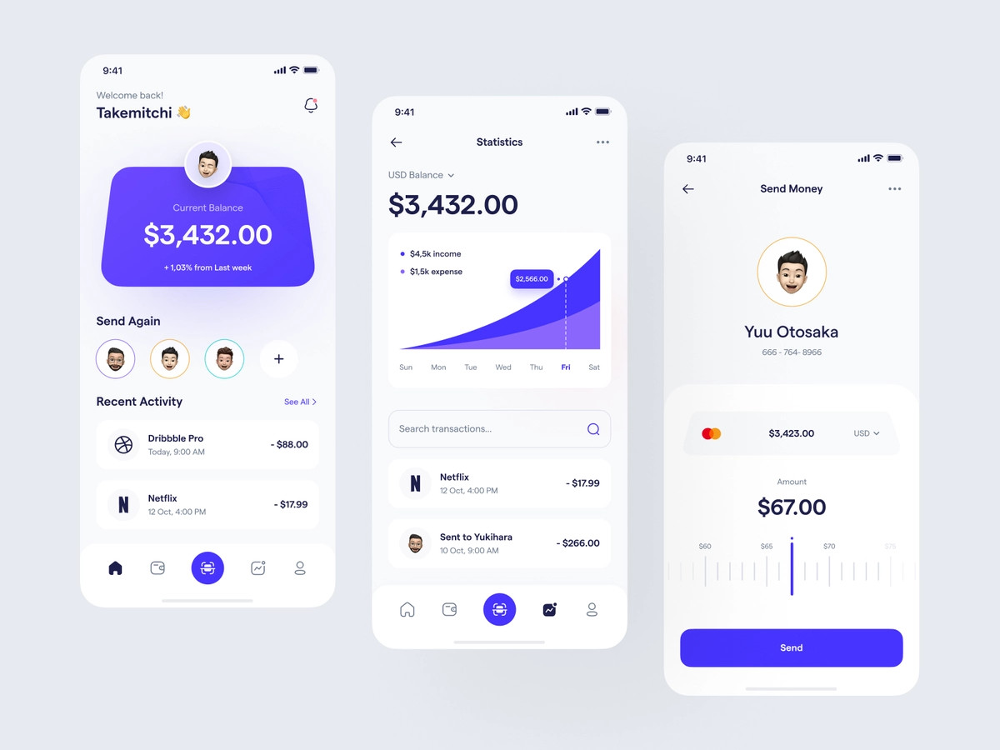
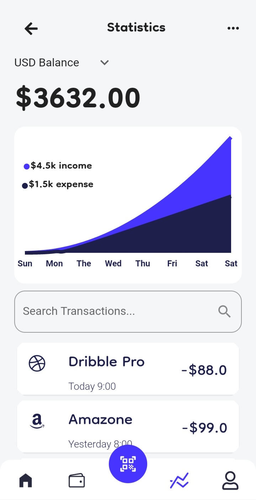
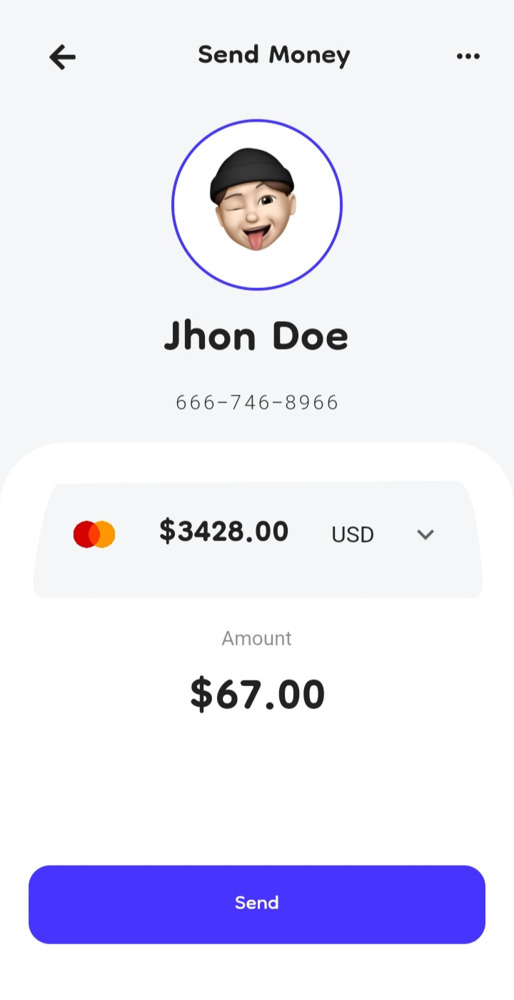

# 🏦 eBank


I was away from my computer and the internet for about 3 months due to the blackout caused by the war going on in my home country. After things calmed and the electricity restored I challenged myself to implement in **Flutter** the UI design I found from [Dribble](https://dribbble.com/shots/16682506-Payoo-Mobile-App "Dribble"). I came accross this clean good looking design and decided to implement it. 
## Original Design
* Original desing is designed by [Rizki AR Khomaini](https://dribbble.com/Rizki_blank "Rizki AR Khomaini").
<br>

<br>

## Screenshots

| Home Screen | Stastics Screen | Transfer Screen |
|-------|-----|-------|
||| 

<br>


## Todo
🚧 The project is not colmpleted yet
* [ ] Standing Candle widget
* [ ] Responsiveness
* [ ] Adabtability
* [ ] Dark Theme

## Install
```bash
git clone https://github.com/itismrx/ebank.git
```

## Run
```bash
flutter run
```
